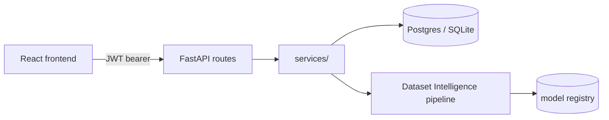

# AI CRM Assistant — Dataset Intelligence Engine

[](LICENSE)
[](tests/)
[](https://www.python.org/)

A multi-tenant CRM backend (FastAPI + SQLAlchemy + Postgres) with an
enterprise auth/RBAC/audit layer and an **AI Dataset Intelligence Engine**:
upload a CSV/XLSX/JSON file and get domain detection, quality/readiness
scoring, model selection with an honest fallback when nothing fits well,
SHAP-explained predictions, plain-English insights and recommendations,
charts, and exportable reports — plus a React/TypeScript frontend.

Built to be a **base you fork**, not a finished product to run as-is: see
[Using this as a base](#using-this-as-a-base-for-your-own-project) below.



## Verified, not aspirational

Every claim below was actually run against a clean checkout while
preparing this base — not carried over from planning notes:

| Check | Result |
|---|---|
| `pip install -r requirements.txt` | Clean, no conflicts |
| `pytest tests/ -v` | **43/43 passed** |
| Service-layer smoke test (`scripts/smoke_test.py`) | **13/13 checks passed** |
| Real HTTP round trip (login → RBAC-protected route → dataset upload → full analysis) | Verified against a running server |
| Unauthenticated request to a protected route | Correctly rejected (401) |
| `npm run build` (frontend, `tsc -b && vite build`) | Clean build, route-level code splitting |
| `scripts/seed_demo.py` against a fresh DB | Healthcare + Finance datasets got **real SHAP-explained predictions**; Retail correctly fell back to insights-only (no trained model) |

Two real bugs were found and fixed while producing this base — worth
knowing about since they explain a couple of files' current shape:

1. **Frontend auth was stubbed out** (`AuthContext`/`ProtectedRoute` always
   reported "authenticated" without calling the real login endpoint or
   storing a token, and `/login` wasn't even routed). This silently
   defeated the backend's real JWT/RBAC system. Fixed — see
   `frontend/src/auth/`.
2. **Floating `scikit-learn`/`joblib`/`shap` versions** (`>=`) let a fresh
   install silently pull a newer sklearn than the committed
   `model_registry/*.joblib` files were pickled with. Models were
   retrained and the versions pinned exactly — see the comment in
   `requirements.txt`.

Known, explicitly-scoped limitations (not bugs — see
`docs/DEPLOYMENT.md`): dataset upload runs synchronously in-request (no
background task queue yet), and the two shipped prediction models are
trained on synthetic data for pipeline validation only.

## Using this as a base for your own project

This repo is structured around four swap-in extension points — a
pluggable data source, a data-driven domain registry, a model registry,
and config-driven feature flags — so adapting it to a different product
doesn't mean rewriting the core. **Start with
[`docs/ARCHITECTURE.md`](docs/ARCHITECTURE.md)**, which maps every layer
and gives a step-by-step checklist for rebranding and retargeting it.

## Demo mode (for showing this to someone who didn't build it)

```bash
python3 scripts/seed_demo.py
```

Creates one login (`demo` / `demo@example.com` / `RecruiterDemo2026!`,
printed to stdout) and pre-loads 3 already-analyzed sample datasets —
Healthcare and Finance both get real SHAP-explained predictions from the
trained demo models, Retail deliberately shows the honest-fallback path —
so the app has real content on first login instead of an empty state. Set
`VITE_DEMO_MODE=true` in `frontend/.env` to also show a "Demo mode" hint
box with a one-click credential-fill button right on the login page. Full
deploy path in [`docs/DEPLOYMENT.md`](docs/DEPLOYMENT.md).

## Prerequisites

- Python 3.12
- Node.js 20+ (tested with 22)
- SQLite is fine for local dev (bundled with Python — nothing to install).
  Postgres 16 is required for staging/prod (enforced by a config
  validator) and for exercising Row-Level Security locally (optional —
  see [Postgres RLS verification](#postgres-rls-verification-optional)).

## Quick start (backend, SQLite)

```bash
python3 -m venv venv
source venv/bin/activate
pip install -r requirements.txt -r requirements-dev.txt

cp .env.example .env   # SQLite + demo seller CSV by default — see below

python3 -m alembic upgrade head          # create the schema
python3 scripts/train_demo_models.py     # populate model_registry/ with real (small, synthetic) models
python3 scripts/generate_demo_sellers.py # populate data/sellers.csv for the seller/prioritization endpoints

uvicorn api.main:app --reload
```

The API is now running at `http://localhost:8000`. Interactive docs at
`http://localhost:8000/docs`. `/healthz` and `/readyz` require no auth.

There's no self-serve signup endpoint (`POST /admin/users` is
admin-only and requires an existing authenticated admin). To create your
first tenant/user for local testing, either:

- Run `python3 scripts/smoke_test.py`, which seeds two tenants
  (`acme` / `jordan@acme.com` / `CorrectHorseBattery9!`) directly via the
  service layer and exercises login, lockout, tenancy isolation, and the
  audit chain end-to-end, or
- Write an equivalent short script — see `scripts/smoke_test.py` for the
  pattern (create a `Tenant`, a `Role` with `DEFAULT_ROLE_PERMISSIONS`, and
  a `User`, inside a `tenant_scope(...)` block).

### Why `DATA_SOURCE_KIND=csv` is the local default

`core/config.py`'s `data_source_kind` setting has three modes:

- `sql` (the default in staging/prod) reads sellers from a marketplace
  system-of-record database view (`vw_sellers_canonical`) that only exists
  in a real deployment.
- `rest` reads sellers from a marketplace REST API.
- `csv` reads sellers from a local file — this is what local dev should use.

`.env.example` sets `DATA_SOURCE_KIND=csv` pointing at
`data/sellers.csv`, which `scripts/generate_demo_sellers.py` populates
with 250 realistic synthetic sellers. Without this, `GET /sellers` and
`GET /prioritization` fail against a fresh local database (there's no
`vw_sellers_canonical` table to query).

## Frontend

```bash
cd frontend
npm install
cp .env.example .env   # points at http://localhost:8000/api/v1 by default
npm run dev
```

`npm run build` type-checks (`tsc -b`) and produces a production bundle
(route-level code splitting: the initial load is ~99KB gzipped, with
`DatasetDetail`'s charts loaded on demand); `npm run lint` runs oxlint.

## Running tests

```bash
python3 -m pytest tests/ -v
```

43 tests covering validation, profiling, domain detection, model
selection, prediction, cross-tenant isolation, and prioritization
threshold resolution — all run against in-memory SQLite, no external
services required.

## Docker Compose (app + Postgres + Redis)

```bash
echo "JWT_SECRET_KEY=$(python3 -c 'import secrets; print(secrets.token_urlsafe(48))')" >> .env
echo "FIELD_ENCRYPTION_KEY=$(python3 -c 'from cryptography.fernet import Fernet; print(Fernet.generate_key().decode())')" >> .env
docker compose up --build
```

(Run those `python3` commands from the project's venv — `cryptography` is a
project dependency, not necessarily available on your system Python.)

`JWT_SECRET_KEY` and `FIELD_ENCRYPTION_KEY` are required (Compose will
refuse to start without them, via `${VAR:?message}` syntax) — the app
container runs with `ENV=staging`, which enforces production-grade secret
strength even for this local Compose stack. Migrations run automatically
on container startup (`docker-entrypoint.sh`); the `postgres` and `redis`
services are health-checked before the `app` container starts.

Note: the seller CSV data source doesn't apply here unless you also set
`DATA_SOURCE_KIND=csv` in the compose environment — the Compose stack is
meant to exercise the real Postgres-backed path (`data_source_kind=sql`),
which needs a `vw_sellers_canonical` view from a real marketplace database
to back the seller/prioritization endpoints.

**Deploying for real (free-tier options included)**: see
[`docs/DEPLOYMENT.md`](docs/DEPLOYMENT.md).

## Postgres RLS verification (optional)

`scripts/test_postgres_rls.py` verifies Row-Level Security policies
against a real (embedded, via `pgserver`) Postgres instance — a defense-in-
depth layer independent of the ORM-level tenant filter that the SQLite-based
pytest suite covers. Requires `requirements-dev.txt` (`pgserver`).

```bash
python3 scripts/test_postgres_rls.py
```

## Project layout

```
api/          FastAPI app, routes, request/response schemas, middleware
core/         config, security (JWT/Argon2), database, tenancy, crypto, logging, metrics
models/       SQLAlchemy models (tenant, user, RBAC, audit, feedback, config, dataset intelligence)
services/     business logic (auth, audit, feedback, prioritization, dataset intelligence pipeline)
alembic/      database migrations
scripts/      one-off setup/verification scripts (see above)
model_registry/  trained model artifacts + metadata, scanned at runtime
frontend/     React + TypeScript + Vite
tests/        pytest suite (SQLite-based)
docs/         ARCHITECTURE.md (extension points) and DEPLOYMENT.md (free-tier deploy path)
```

See `IMPLEMENTATION_PLAN.md` and `CHECKPOINT*.md` for the detailed design
history and rationale behind specific decisions (tenancy model, audit
chain, model selection fallback logic, etc.). See `docs/ARCHITECTURE.md`
for the layer map and extension points if you're building on this repo
rather than just running it.

## License

MIT — see [`LICENSE`](LICENSE). Fork it, rebrand it, ship it.
