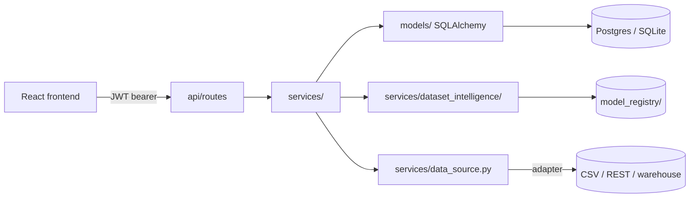

# Architecture & Extension Guide

This document is for someone forking this repo to build their own product on
top of it. It maps the layers, names the four places designed to be swapped
or extended, and gives a checklist for adapting it to a new domain.

## Layer map

```
api/            HTTP layer only — routes, request/response schemas,
                auth/tenant dependencies. No business logic lives here.
services/       Business logic. Framework-agnostic — every function here
                is testable by calling it directly with a DB session,
                no HTTP required (see tests/ and scripts/smoke_test.py).
models/         SQLAlchemy ORM models. Every tenant-scoped table mixes in
                TenantScopedMixin (models/base.py) — see "Tenancy" below.
core/           Cross-cutting infrastructure: config, security (hashing,
                JWT), the tenant ContextVar, structured logging, metrics,
                field-level encryption. Nothing product-specific belongs
                here — if you're adding a business rule, it doesn't go
                in core/.
services/dataset_intelligence/
                A self-contained pipeline: validate → read → clean →
                profile → detect domain → score quality/readiness →
                match schema → select model → predict → explain (SHAP)
                → generate insights → recommend → visualize → export.
                Each stage is one file; stages compose in pipeline.py.
frontend/       React + TypeScript + Vite + Tailwind. Talks to the API
                only through frontend/src/api/client.ts.
```



## Tenancy (read this before touching anything else)

Every tenant-scoped table inherits `TenantScopedMixin`. A request-scoped
`ContextVar` (`core/tenancy.py`) carries the current tenant, and an
`with_loader_criteria` hook filters every query automatically — you don't
add `WHERE tenant_id = ...` by hand. Two things to know if you extend this:

1. **New tenant-scoped models** must inherit `TenantScopedMixin` and be
   written inside a `tenant_scope(...)` context (see any function in
   `services/` for the pattern). The insert guard in `models/base.py`
   raises if you don't.
2. **`Session.get()` bypasses the filter** on identity-map hits. Use
   `core.database.session_scope_for_tenant()` for any batch/background job
   that might touch more than one tenant's data in the same process — see
   the docstring there and `tests/dataset_intelligence/test_tenancy_isolation.py`
   for why.

## The four extension points

### 1. Swap what "seller" data means — `services/data_source.py`

Services depend on the `SellerDataSource` Protocol, not a concrete class.
The repo ships a CSV adapter for local dev; a SQL adapter reads a real
system-of-record. To point this at your own data:

- Implement the Protocol against your source (REST API, warehouse, Kafka
  change stream — whatever you have).
- Map your schema to `SellerRecord` (the canonical shape services expect).
- Switch `DATA_SOURCE_KIND` in `.env` — no other code changes needed.
- For freshness at scale, wrap your adapter in `CachedSellerDataSource`
  (Redis-backed TTL cache) or `IncrementalSellerDataSource` (watermark-based
  incremental pulls) — both already exist in the same file.

This is also the right pattern if "seller" isn't your domain at all —
rename `SellerRecord` to your entity, keep the Protocol shape, and the
prioritization/feedback services keep working unchanged.

### 2. Add a new dataset domain — `services/dataset_intelligence/domain_knowledge.py`

Domains are **data, not code**. Each `DomainSpec` is signature columns,
keyword vocabulary, known numeric ranges, and an expected numerical/
categorical mix. Adding domain #21 (or retuning an existing one) means
adding a `DomainSpec` entry here — `domain_detection.py`'s scoring logic
never changes.

### 3. Add a real predictive model — `model_registry/<domain>/`

Drop a `joblib`-serialized model plus a metadata JSON (required/optional
feature schema, dtypes) next to the existing ones. `model_selection.py`
scores incoming datasets against every registered model's schema and picks
the best match above threshold, falling back to exploratory-insights-only
when nothing matches well enough — see the `fallback_reason` field in any
`/datasets/{id}/analysis` response for how this degrades honestly instead
of forcing a bad prediction.

**Before you ship a new model**: the two shipped models
(`model_registry/healthcare/`, `model_registry/finance/`) are trained on
synthetic data for pipeline validation only — replace them with real
trained models before using predictions for actual decisions. Whatever
library you train with, pin its exact version in `requirements.txt` (see
the comment there) — a floating `>=` on scikit-learn/joblib/shap will
silently install a newer version than your artifacts were pickled with.

### 4. Config-driven feature flags — `core/config.py`

Already wired and ready to use without code changes:

| Flag | What it does |
|---|---|
| `ENABLE_LLM_FEATURES` + `OPENAI_API_KEY` | Turns on LLM-polished insight text (feature-flagged, times out and falls back to template text on any failure — never blocks the pipeline) |
| `ENABLE_FEEDBACK_LOOP` | Turns the recommendation feedback → learned-weight aggregation on/off |
| `OIDC_ENABLED` + `OIDC_*` | Switches from local password auth to SSO |
| `REDIS_URL` | Blank disables distributed rate limiting (fine for single-instance/local); set it to enable |
| `APP_NAME` | Rebrand — flows into JWT issuer claim and structured logs |

## Adapting this to a different product — checklist

1. Rename the product: `APP_NAME` in `.env`, `<title>` in `frontend/index.html`,
   the header text in `frontend/src/pages/*.tsx`.
2. Point `services/data_source.py` at your real data (extension point 1).
3. If you're keeping the Dataset Intelligence Engine: add/edit `DomainSpec`
   entries for your domains (extension point 2); otherwise delete
   `services/dataset_intelligence/`, its routes in `api/main.py`, and the
   corresponding frontend pages — nothing else depends on it.
4. Update `models/rbac.py`'s `DEFAULT_ROLE_PERMISSIONS` for your own roles.
5. Regenerate secrets — never reuse `.env.example`'s dev values (see
   `docs/DEPLOYMENT.md`).
6. Run `pytest tests/ -v` and `scripts/smoke_test.py` after any change to
   `core/tenancy.py`, `models/base.py`, or `api/deps.py` specifically —
   those three have a documented history of thread-pool/ContextVar bugs
   that only surface under real HTTP dispatch (see `CHECKPOINT_DATASET_INTELLIGENCE.md`
   §"Bugs found and fixed" if you're curious why the tests are structured
   the way they are).
